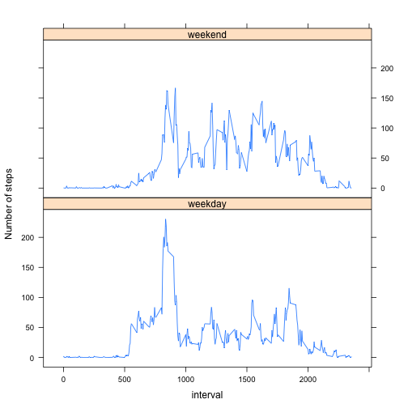

Reproducible Research: Peer Assessment 1
============================================

## Loading and preprocessing the data

Unzip the "activity.zip" file to your working directory and read in the "activity.csv" file

```r
unzip("activity.zip")
data <- read.csv("activity.csv", header=TRUE)
```

Our dataset has the following structure:

```r
str(data)
```

```
## 'data.frame':	17568 obs. of  3 variables:
##  $ steps   : int  NA NA NA NA NA NA NA NA NA NA ...
##  $ date    : Factor w/ 61 levels "2012-10-01","2012-10-02",..: 1 1 1 1 1 1 1 1 1 1 ...
##  $ interval: int  0 5 10 15 20 25 30 35 40 45 ...
```
To take a look at the first few rows of the `data`, do:

```r
head(data)
```

```
##   steps       date interval
## 1    NA 2012-10-01        0
## 2    NA 2012-10-01        5
## 3    NA 2012-10-01       10
## 4    NA 2012-10-01       15
## 5    NA 2012-10-01       20
## 6    NA 2012-10-01       25
```

## What is mean total number of steps taken per day?

### 1. Make a histogram of the total number of steps taken each day

Calculate the total number of steps taken each day by splitting the dataset by date and summing up all the steps taken on that date.

```r
totalsteps <- as.numeric(tapply(data$steps, data$date, sum))
```
Plot histogram of the total number of steps taken per day

```r
hist(totalsteps, main = "Histogram of total number of steps", 
     xlab = "Total number of steps taken per day")
```

 

### 2. Calculate and report the mean and median total number of steps taken per day

**Mean** total number of steps taken per day is:

```r
mean(totalsteps, na.rm = TRUE)
```

```
## [1] 10766.19
```

**Median** total number of steps taken per day is:

```r
median(totalsteps, na.rm=TRUE)
```

```
## [1] 10765
```

## What is the average daily activity pattern?

### 1. Make a time series plot (i.e. type = "l") of the 5-minute interval (x-axis) and the average number of steps taken, averaged across all days (y-axis) 

Calculate the average number of steps taken in each 5-minute interval across all days. 

```r
nsteps <- as.numeric(tapply(data$steps, data$interval, mean, na.rm=TRUE))
```
Create new data frame `av.activity` that stores the values of 5-minute intervals and corresponding average number of steps taken

```r
av.activity <- data.frame(interval = as.numeric(levels(as.factor(data$interval))), 
                          nsteps = nsteps)
```
Show a time series plot of the 5-minute interval (x-axis) and the average number of steps taken, averaged across all days (y-axis)

```r
plot(av.activity$interval, av.activity$nsteps, type = "l", 
     main = "Average number of steps across all days",
     xlab = "5-minute interval", ylab = "Number of steps")
```

 

### 2. Which 5-minute interval, on average across all the days in the dataset, contains the maximum number of steps?

The 5-minute interval with the highest average number of steps is

```r
av.activity$interval[av.activity$nsteps == max(av.activity$nsteps)]
```

```
## [1] 835
```
This interval corresponds to the interval between 8:35 AM and 8.40 AM.

## Imputing missing values

### 1. Calculate and report the total number of missing values in the dataset (i.e. the total number of rows with NAs)

Total number of missing values in the dataset is 2304.

```r
sum(is.na(data))
```

```
## [1] 2304
```

### 2. To fill the missing values in the dataset use the average number of steps for that 5-minute interval calculated above. 

First, split the dataset by 5-minute intervals. Then, in each set of 'step number' values identify NA values, look in `av.activity` for the 'number of steps' value that corresponds to the 5-minute interval that set is for and replace NAs.

```r
newdata <- split(data, data$interval)
newdata <- lapply(newdata, function(x) {
    x$steps[is.na(x$steps)] <- av.activity$nsteps[av.activity$interval == x$interval[1]]; 
    x})
```

### 3. Finally, use the `unsplit()` function to reverse the effects of splitting and return lists of data into a new data frame called `newdata` that is equal to the original dataset but with the missing data filled in.

```r
newdata <- unsplit(newdata, data$interval)
```
Here is what the new dataset looks like (the first few rows):

```r
head(newdata)
```

```
##       steps       date interval
## 1 1.7169811 2012-10-01        0
## 2 0.3396226 2012-10-01        5
## 3 0.1320755 2012-10-01       10
## 4 0.1509434 2012-10-01       15
## 5 0.0754717 2012-10-01       20
## 6 2.0943396 2012-10-01       25
```

### 4. Make a histogram of the total number of steps taken each day with new dataset.


```r
new.totalsteps <- as.numeric(tapply(newdata$steps, newdata$date, sum))
hist(new.totalsteps, main = "Histogram of total number of steps (missing values imputed)", 
     xlab = "Total number of steps taken per day")
```

 

Calculate and report the **mean** and **median** total number of steps taken per day with new dataset.

**Mean** total number of steps taken per day is:

```r
mean(new.totalsteps)
```

```
## [1] 10766.19
```

**Median** total number of steps taken per day is:

```r
median(new.totalsteps)
```

```
## [1] 10766.19
```
 
## Are there differences in activity patterns between weekdays and weekends?

### 1. Create a new factor variable in the dataset with two levels -- "weekday" and "weekend" indicating whether a given date is a weekday or weekend day.


```r
weekpart <- weekdays(as.Date(newdata$date)) %in% c("Sunday", "Saturday")
newdata$weekpart <- factor(weekpart, labels = c("weekday", "weekend"))
```
The dataset `newdata` now has the structure:

```r
str(newdata)
```

```
## 'data.frame':	17568 obs. of  4 variables:
##  $ steps   : num  1.717 0.3396 0.1321 0.1509 0.0755 ...
##  $ date    : Factor w/ 61 levels "2012-10-01","2012-10-02",..: 1 1 1 1 1 1 1 1 1 1 ...
##  $ interval: int  0 5 10 15 20 25 30 35 40 45 ...
##  $ weekpart: Factor w/ 2 levels "weekday","weekend": 1 1 1 1 1 1 1 1 1 1 ...
```
and looks like:

```r
head(newdata)
```

```
##       steps       date interval weekpart
## 1 1.7169811 2012-10-01        0  weekday
## 2 0.3396226 2012-10-01        5  weekday
## 3 0.1320755 2012-10-01       10  weekday
## 4 0.1509434 2012-10-01       15  weekday
## 5 0.0754717 2012-10-01       20  weekday
## 6 2.0943396 2012-10-01       25  weekday
```

### 2. Make a panel plot containing a time series plot (i.e. type = "l") of the 5-minute interval (x-axis) and the average number of steps taken, averaged across all weekday days or weekend days (y-axis).

First, split the data into 2 sets, one containing the data for weekdays and other for weekend days, and in each set calculate the average number of steps taken per 5-minute interval across all days that belong to the set.

```r
average <- lapply(split(newdata, newdata$weekpart), 
                  function(x) as.numeric(tapply(x$steps, x$interval, mean)))

interval = as.numeric(levels(as.factor(data$interval)))
av.weekday <- data.frame(interval = interval, nsteps = average$weekday, 
                         weekpart = as.factor("weekday"))
av.weekend <- data.frame(interval = interval, nsteps = average$weekend, 
                         weekpart = as.factor("weekend"))
```
Bind those values into one data frame called `weekActivity`

```r
weekActivity <- rbind(av.weekday, av.weekend)
```
Show a panel plot comparing the average number of steps taken per 5-minute interval across weekdays and weekends (here is used *lattice* plotting system).  


```r
library(lattice)
xyplot(nsteps ~ interval | weekpart, data = weekActivity, 
       type = "l", layout=c(1,2), ylab = "Number of steps")
```

 


